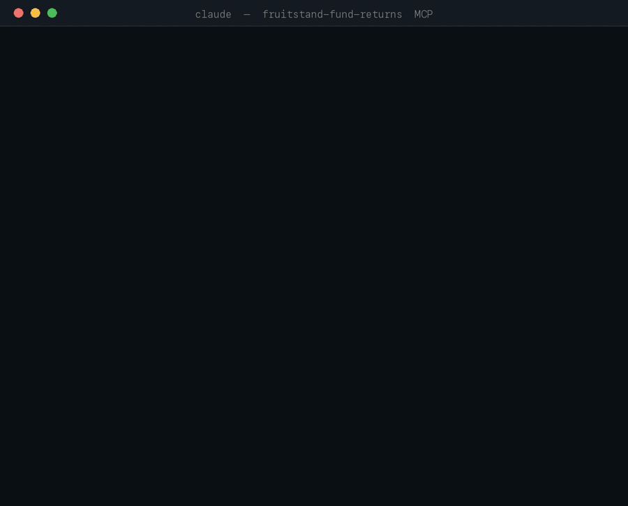

# Fruit Stand Fund Returns — MCP Server

**Live trailing & calendar-year total returns for 32,000+ US mutual funds and ETFs, as an [MCP](https://modelcontextprotocol.io) server.**
Ask an AI assistant to compare fund performance by ticker — no Morningstar or Bloomberg contract, free tier, same API key as the REST API.

> Hosted, remote MCP over Streamable HTTP · works with Claude, Cursor, and any MCP client · [get a free API key](https://app.fruitstand.dev/pricing)



<!-- assets/demo.mp4 is the source clip; regenerate the GIF with scripts/make-demo-gif.sh -->


---

## Quick start

### 1. Get an API key

Sign up at **[app.fruitstand.dev](https://app.fruitstand.dev/pricing)** — the free tier needs no card.

### 2. Point your client at the endpoint

```
https://api.fruitstand.dev/mcp
```

Remote MCP over Streamable HTTP, authenticated with your API key as a **bearer token**.

**Native remote-MCP clients** (Claude web/desktop "Add custom connector", Cursor, etc.) — use the URL above and add the header:

```
Authorization: Bearer YOUR_API_KEY
```

**Claude Desktop config** (`claude_desktop_config.json`) — bridge to the remote endpoint with `mcp-remote`:

```json
{
  "mcpServers": {
    "fruit-stand": {
      "command": "npx",
      "args": [
        "mcp-remote",
        "https://api.fruitstand.dev/mcp",
        "--header",
        "Authorization: Bearer YOUR_API_KEY"
      ]
    }
  }
}
```

Restart the client and the Fruit Stand tools appear.

### 3. Ask a question

> *"Compare the 1-year, 5-year, and since-inception returns of SPY, QQQ, and VTI, and tell me which had the best 2022 calendar year."*

The assistant calls `batchTrailingReturns` and `batchCalendarReturns` and summarizes.

---

## Tools

Six tools, mirroring the REST API. Returns come back as decimal fractions (`0.1234` = 12.34%).

| Tool | Does | Key inputs |
|---|---|---|
| `searchFunds` | Search / list the fund universe (keyset paginated) | `q`, `type`, `country`, `exchange`, `cursor`, `limit` |
| `getFund` | Fund metadata by ticker | `code` |
| `getTrailingReturns` | Trailing returns for one fund (latest or as-of a date) | `code`, `as_of?` |
| `batchTrailingReturns` | Trailing returns for up to 100 funds in one call | `codes[]`, `as_of?` |
| `getCalendarReturns` | Calendar-year return for one fund (latest or a given year) | `code`, `year?` |
| `batchCalendarReturns` | Calendar-year returns for up to 100 funds in one call | `codes[]`, `year?` |

Tickers use the `SYMBOL.US` form (e.g. `SPY.US`, `VTSAX.US`).

---

## About the data

- **Coverage:** ~32,000 US mutual funds & ETFs.
- **Trailing returns:** standard windows through since-inception, total return (distributions reinvested).
- **Calendar returns:** full-year total return per calendar year.
- **Freshness:** refreshed daily from the same pipeline that builds the Fruit Stand datasets on Snowflake Marketplace.
- **Methodology & field reference:** [app.fruitstand.dev/api/mcp](https://app.fruitstand.dev/api/mcp) and the [docs](https://fruitstand.dev).

MCP tool calls are metered exactly like REST calls and count against your monthly quota. A key with no active plan gets a `403` on tool calls.

---

## Links

- **Get a key / pricing:** https://app.fruitstand.dev/pricing
- **MCP setup docs:** https://app.fruitstand.dev/api/mcp
- **REST API reference:** https://app.fruitstand.dev/api
- **Marketing site:** https://fruitstand.dev
- **Status of the data pipeline / datasets:** https://fruitstand.dev/datasets

## License

[MIT](LICENSE) — this repo holds the public docs and connector metadata for the hosted service; the service implementation lives in a separate repo.
